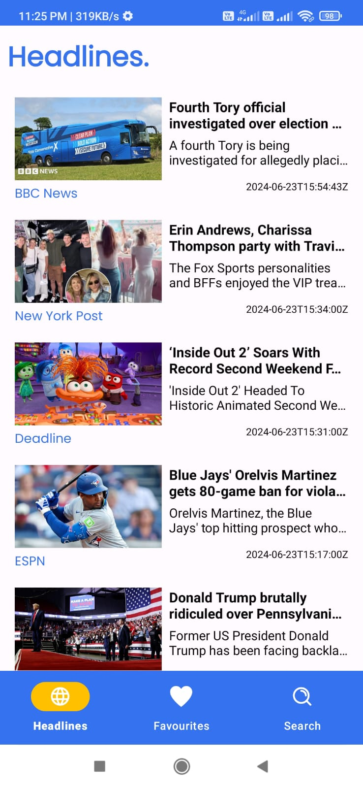
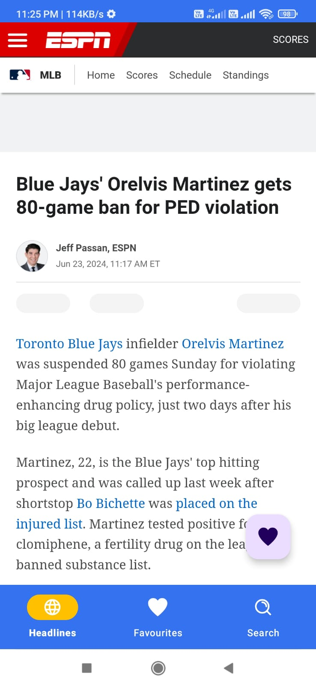

# NewsApp

NewsApp is an Android application that provides users with the latest news articles from various sources. The app fetches news data from a remote API and displays it in a user-friendly interface.

## Table of Contents

- [Features](#features)
- [Screenshots](#screenshots)
- [Installation](#installation)
- [Usage](#usage)
- [Architecture](#architecture)
- [Libraries Used](#libraries-used)
- [License](#license)

## Features

- Fetches the latest news articles from a remote API
- Displays news articles in a list
- Users can view detailed news articles
- Search functionality to find specific news articles
- Responsive and user-friendly UI

## Screenshots

<div>
   
   
   
</div>

## Installation

1. **Clone the repository:**

   ```bash
   git clone https://github.com/NishalNT/NewsApp-Android.git
   ```
2. Open the project in Android Studio:

  + Open Android Studio
  + Select Open an existing Android Studio project
  + Navigate to the cloned repository directory and select it
  
3. Get an API Key:

  + This app uses the NewsAPI to fetch news articles. You will need an API key from `[https://newsapi.org](https://newsapi.org/)`.

  + Sign up on NewsAPI and get your API key.
4. Add the API Key to the project:
  + Open `util/Constants` and add the `api_key`
  
5. Run the app:

  + Connect your Android device or start an emulator
  + Click on the `Run` button in Android Studio
## Usage1
1. Home Screen:

  + Displays the latest news articles in a list.
  + Click on any article to view its details.
2. Article Detail:

  + Displays the full content of the selected news article.
3. Search:

  + Use the search bar to find news articles based on keywords.
## Architecture
 +The app follows the MVVM (Model-View-ViewModel) architecture pattern to ensure a clean separation of concerns and to make the code more maintainable.
   + Model:
     + Represents the data layer of the application. It includes data classes and repository classes that handle data operations.
   + View:
     + Represents the UI layer of the application. It includes Activities and Fragments that display data to the user.
   + ViewModel:
     + Acts as a bridge between the Model and the View. It holds the data and business logic, exposing it to the View.
## Libraries Used
+ Retrofit: For network calls to fetch news data from the API
+ Glide: For image loading and caching
+ LiveData: For observable data holders
+ ViewModel: For managing UI-related data in a lifecycle-conscious way
+ RecyclerView: For displaying a list of news articles
+ Room: For local database storage (if applicable)

## License
This project is licensed under the MIT License - see the [LICENSE](LICENSE) file for details.
